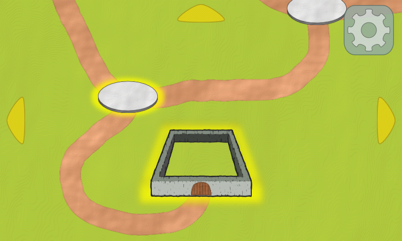
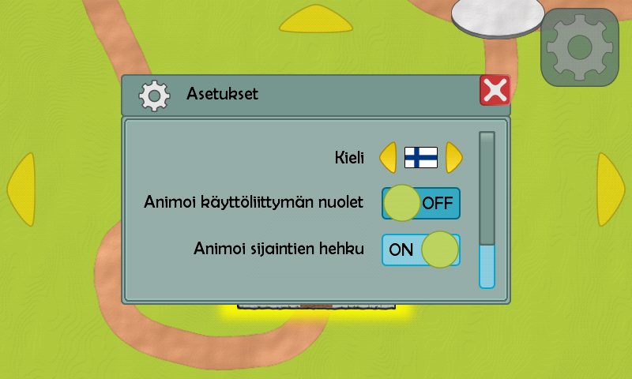
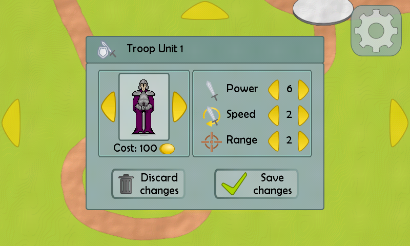
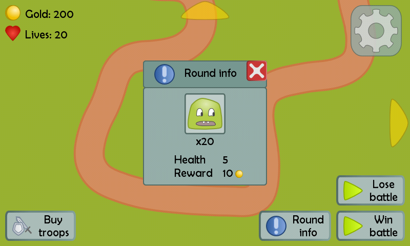

# Android hybrid game GUI

<h2>About</h2>
The beginning of an Android game, programmed for the course UI Programming during the <b>autumn of 2015</b>. No real gameplay, just the initial GUI. The vision of the game is a hybrid of tower defense, real-time strategy and role-playing game. At the moment no real game logic is present.  
During the creation I learned how to operate the <b>LibGDX</b> library and some <b>Android</b> things.
 

<h2>Screenshots</h2>
<b>Map view. This is the default starting view.</b>
  
<b>Options. Changes reflect immediately in the GUI.</b>
  
<b>Unit Editing. The battles are fought will self-created units.</b>
  
<b>Battle view. Viewing next round's enemy info.</b>

